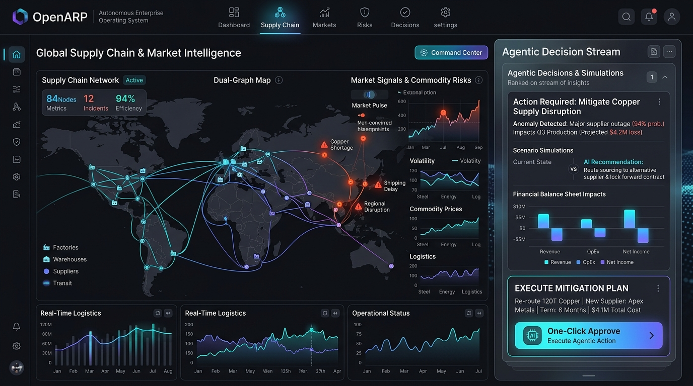
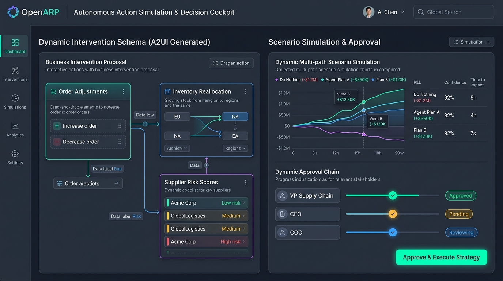

<div align="center">

# OpenARP

### 🧠 Agentic Resource Planning: The Autonomous Decision & Planning Operating System

<p align="center">
  <b>Reimagining enterprise operations from static "digital filing cabinets" to proactive, 24/7 decision-making brains.</b>
</p>

[](LICENSE)
[](https://github.com/zeanin/openarp)
[](https://nodejs.org)
[](https://pnpm.io)
[](https://www.docker.com/)

[**Explore Features**](#-core-capabilities) • [**Architecture**](#-architecture-overview) • [**Quick Start**](#-quick-start) • [**Tech Stack**](#-tech-stack) • [**Documentation**](./docs)

<br/>



</div>

---

## 💡 Why OpenARP?

For decades, enterprises have relied on **ERP (Enterprise Resource Planning)** systems. While ERPs excel at recording historical transactions for accounting and audits, their rigid architectures were never engineered for proactive decision-making. 

Attaching an AI Copilot to a legacy database is like mounting a jet engine to a horse carriage—it speeds up data retrieval, but the core system remains a passive recording archive.

**OpenARP introduces a category shift: Agentic Resource Planning (ARP).**

| Dimension | Traditional ERP | OpenARP |
| :--- | :--- | :--- |
| **System Metaphor** | Passive "Digital Filing Cabinet" | Proactive "Enterprise Brain" |
| **Information Scope** | Siloed internal data (finance, inventory, HR) | **Dual-Graph Perception**: Internal operations + Real-time external world signals |
| **Primary Output** | Delayed dashboards and passive static reports | **Executable Actions & Strategies** with scenario simulations |
| **Human Role** | Data analyst (manual report assembly) | **Decision Approver** (1-click approval & oversight) |
| **Response Window** | Post-incident review (lagging days/weeks) | **24/7 Continuous Monitoring** with real-time risk mitigation |

---

## ✨ Core Capabilities

### 1. 🌐 Dual-Graph Perception: Connecting Internal Operations with the World


Traditional software operates in a vacuum. OpenARP dynamically reconciles two interconnected knowledge graphs in real time:
- **Internal Enterprise Graph:** Live inventory levels, production capacities, purchase orders, financial balances, and workforce allocations.
- **External World Dynamic Graph:** Commodity spot prices, shipping routes & port congestions, geopolitical supply disruptions, competitor disclosures, and macroeconomic trends.

> **OpenARP doesn't just tell you what happened inside; it predicts how external shifts affect your bottom line and formulates what you should do next.**

---

### 2. 🎯 Action-First Decision Cockpit: From Reports to One-Click Execution



ERP systems generate charts for meetings; **OpenARP generates actions for execution**.
- **Continuous Vigilance (7x24):** Autonomous AI agents continuously monitor the dual graph for anomalies and cost optimizations.
- **Multi-Path Scenario Simulation:** Simulates multiple counter-strategies simultaneously (e.g., *Do Nothing (-$1.2M)* vs. *Alternative Supplier A (+$350K)* vs. *Forward Hedging (+$120K)*).
- **Quantified P&L Impacts:** Calculates bottom-line financial effects, operational delivery times, and risk confidence scores before actions are taken.
- **Human-in-the-Loop Approval:** Presents complete, validated action payloads for one-click executive sign-off.

---

### 3. 🧩 Dynamic Schema & Generative A2UI Engine


Enterprise needs evolve faster than development cycles. OpenARP integrates a runtime dynamic schema engine:
- **Natural Language Schema Creation:** Describe business requirements to instantiate PostgreSQL database tables, relationships, and validation rules instantly.
- **A2UI Generative Interfaces:** JSON Schema-driven components render rich, interactive approval cards, tables, forms, and workflows at runtime without re-compiling code.
- **Zero-Downtime Adaptability:** Safely evolve business models and data collections on the fly while retaining enterprise data integrity.

---

## 🏛️ Architecture Overview

```text
  ┌─────────────────────────────────────────────────────────────────┐
  │                    EXTERNAL WORLD SIGNALS                       │
  │     Commodity Prices • Supply Disruptions • Macro Trends        │
  └───────────────────────────────┬─────────────────────────────────┘
                                  │
                                  ▼
 ┌───────────────────────────────────────────────────────────────────┐
 │               OPENARP DUAL-GRAPH INTELLIGENCE CORE                │
 │  ┌─────────────────────────┐         ┌─────────────────────────┐  │
 │  │ External Dynamics Graph │ ◄──────►│ Internal Business Graph │  │
 │  └─────────────────────────┘         └─────────────────────────┘  │
 │                                 │                                 │
 │                                 ▼                                 │
 │  ┌─────────────────────────────────────────────────────────────┐  │
 │  │             AGENTIC DECISION & SIMULATION ENGINE            │  │
 │  │    • Anomaly Detection     • Multi-Path Scenario Sim        │  │
 │  │    • P&L Impact Calculation• Executable Plan Generation     │  │
 │  └──────────────────────────────┬──────────────────────────────┘  │
 └─────────────────────────────────┼─────────────────────────────────┘
                                   │
                                   ▼
 ┌───────────────────────────────────────────────────────────────────┐
 │            A2UI INTERACTIVE COCKPIT & HUMAN-IN-THE-LOOP           │
 │               [ Proactive Strategy & Impact Cards ]               │
 │                   [ 🔘 1-Click Approve & Execute ]                │
 └─────────────────────────────────┬─────────────────────────────────┘
                                   │ Approved
                                   ▼
 ┌───────────────────────────────────────────────────────────────────┐
 │                   AUTONOMOUS WORKFLOW EXECUTION                   │
 │       Orders Placed • Inventory Reallocated • Suppliers Notified   │
 └───────────────────────────────────────────────────────────────────┘
```

---

## 🛠 Tech Stack

- **Monorepo Architecture:** Turborepo + pnpm workspaces
- **Frontend Stack:** React 18 + Vite + Schema Engine + Vanilla CSS
- **Backend Core:** Node.js (>=20) + Koa + Dynamic Resourcer (REST/GraphQL routing)
- **Database & Vectors:** PostgreSQL 16 (with `pgvector` extension) + Sequelize ORM + Redis 7
- **AI & Agent Runtime:** Multi-provider LLM Layer (OpenAI, Anthropic, DeepSeek, Local LLMs)
- **Security & RBAC/ABAC:** JWT authentication + Granular Attribute-Based Access Control
- **DevOps & Containers:** Docker & Docker Compose

---

## 🚀 Quick Start

### 1. Prerequisites
- **Node.js** >= 20.0.0
- **pnpm** >= 9.0.0
- **Docker & Docker Compose**

### 2. Clone & Install
```bash
git clone https://github.com/zeanin/openarp.git
cd openarp
pnpm install
```

### 3. Environment Configuration
Create a `.env` file from the provided example:
```bash
cp .env.example .env
```
Provide your database connection details and LLM API keys:
```env
OPENAI_API_KEY=your_openai_api_key_here
# or ANTHROPIC_API_KEY=your_anthropic_api_key_here
```

### 4. Start Infrastructure & Development Server
```bash
# Start PostgreSQL & Redis services
pnpm docker:up

# Launch server (:3000) and web app (:5173) in dev mode
pnpm dev
```

Open **`http://localhost:5173`** in your browser.

---

## 📦 Monorepo Structure

```text
openarp/
├── apps/
│   ├── server/               # OpenARP Core Server (Koa + Plugin Engine)
│   └── web/                  # Web Client (React + Schema-driven UI)
├── packages/
│   ├── core/
│   │   ├── ai/               # Agent orchestration & LLM abstraction
│   │   ├── database/         # Dynamic Collection Manager & ORM adapter
│   │   ├── resourcer/        # Dynamic resource endpoint router
│   │   ├── schema-engine/    # Runtime JSON Schema UI renderer
│   │   └── server/           # OpenARP application container & lifecycle
│   └── plugins/              # Modular plugins (ACL, Workflows, Audit, etc.)
├── assets/                   # Architecture & UI showcase imagery
├── docs/                     # Guides & Agentic Resource Planning whitepapers
└── docker-compose.yml        # Infrastructure container orchestration
```

---

## 🐳 Production Deployment

Run the complete production stack with Docker:

```bash
# Build and run containers
pnpm docker:up

# Or build the application container directly:
docker build -t openarp .
```

---

## 📄 License

This project is licensed under the **Apache License 2.0 with Commons Clause Condition v1.0**.

Under the Commons Clause condition, you are free to download, run, modify, and distribute the code for personal or internal use, but you **may not sell the software or use it to provide commercial hosting, cloud, or Software-as-a-Service (SaaS) platforms** to third parties.

See the [LICENSE](file:///Users/landaa/Workspaces/formai/FormAI/LICENSE) file for complete terms and details.
